# Assignment #1: HTML & CSS Basics

**Student Name:** Muktar Aikorkem
**Group:** Your Group  
**Course:** Front-End Development  
**Live Site (GitHub Pages):** [https://github.com/Aikorkem07/web1-fronted-.git]

---

## Tasks & Implementation

### Part 1: Introduction to HTML

- **Step 0 – HTML Boilerplate:** Created `index.html` with the standard HTML5 structure (`<!DOCTYPE html>`, `<html>`, `<head>`, `<title>`, `<body>`) and set the page title to "My First Webpage".
- **Step 1 – Structuring Text:** Used `<h1>`, `<h2>`, and `<h3>` for my name, group, and the "About Me" section, followed by a `
` paragraph describing myself.
- **Step 2 – Lists:** Built an ordered list (`<ol>`) of my hobbies and an unordered list (`<ul>`) linking to my favorite websites.
- **Step 3 – Images and Links:** Added a personal photo with `` and included clickable `<a>` links opening in a new tab (`target="_blank"`).
- **Step 4 – Buttons:** Added a `<button>` labeled "Click Me" (no functionality required at this stage).

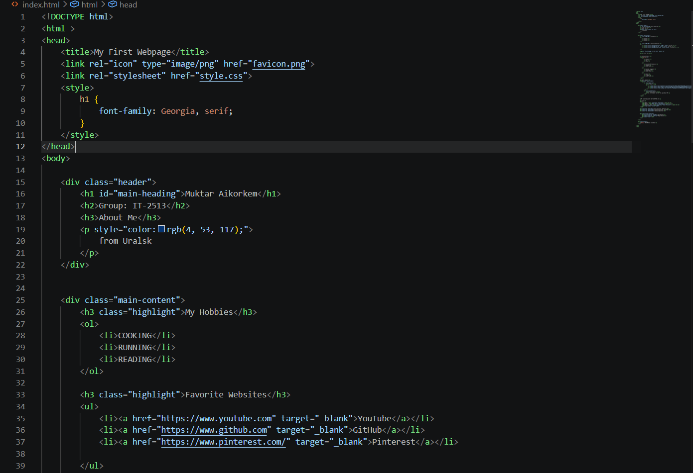
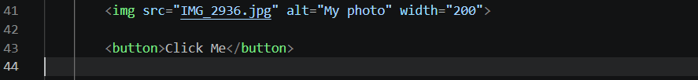
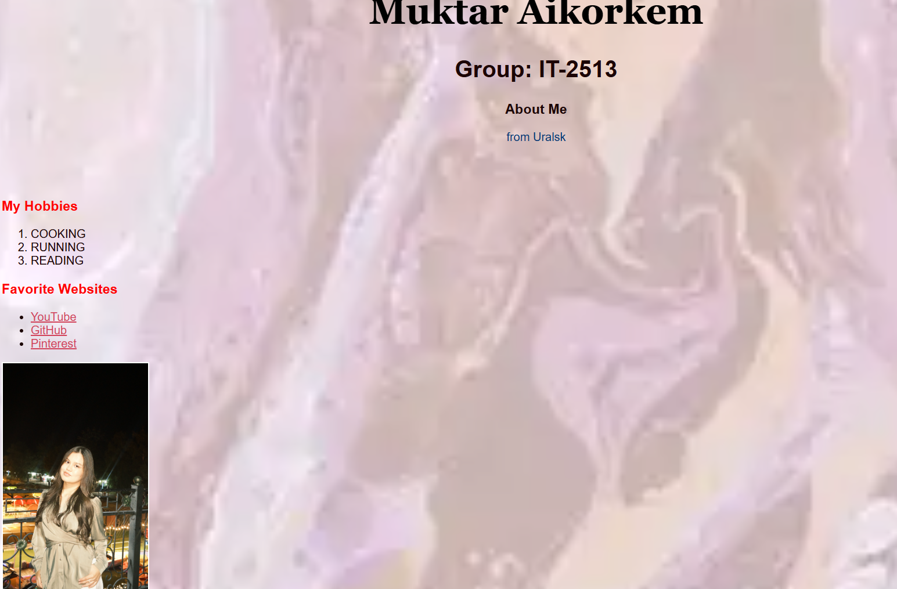
---

### Part 2: Intermediate HTML

- **Step 5 – Tables:** Created a weekly schedule table using `<table>`, `<tr>`, `<th>`, `<td>` with the columns "Subject", "Day", and "Time".
- **Step 6 – Table Layout:** Built a two-column layout table (`.layout-table`) with a menu on the left (`.menu-col`) and main content on the right (`.content-col`).
- **Step 7 – Emojis:** Added emojis inside a paragraph describing my mood for the day.
- **Step 8 – Forms:** Created a form with `Name` (text), `Email` (email), `Favorite Color` (color input), and a Submit button.

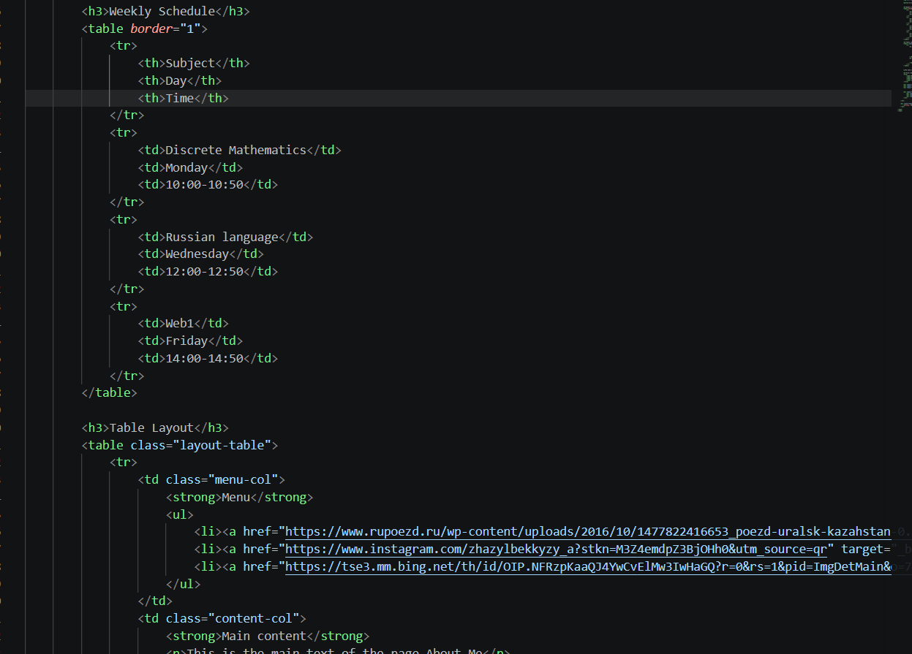
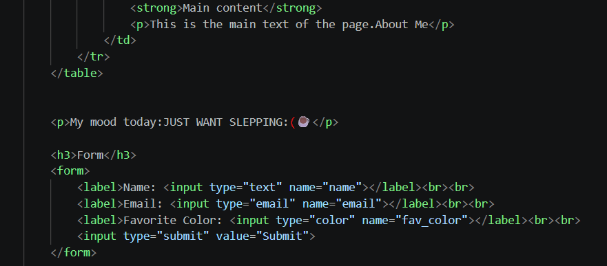
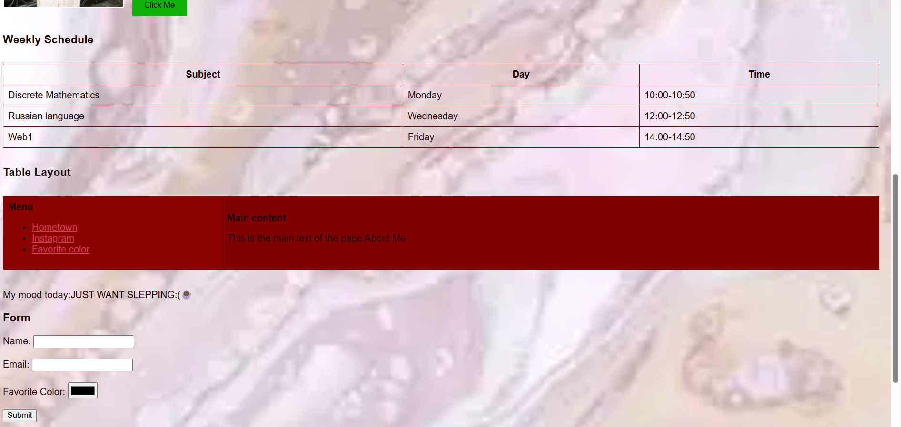

---

### Part 3: Introduction to CSS

- **Step 9 – Intro to CSS:** Styled the page background, typography, and section colors.
- **Step 10 – Inline CSS:** Applied an inline style directly to a paragraph (`style="color:blue;"`).
- **Step 11 – Internal CSS:** Added a `<style>` block inside `<head>` to set the heading font family.
- **Step 12 – External CSS:** Created `style.css` and linked it with `<link rel="stylesheet" href="style.css">`, moving all styling rules there.
- **Step 13 – Selectors:** Used element selectors (`p`, `a`, `table`), a class selector (`.highlight`), and an ID selector (`#main-heading`).
- **Step 14 – Classes vs. IDs:** Created the `.highlight` class to style section titles, and the `#main-heading` ID to style my main `<h1>`.

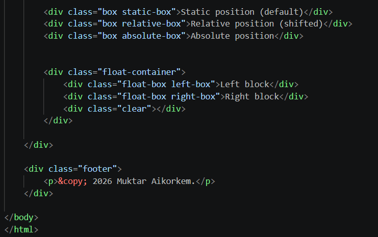

---

### Part 4: Intermediate CSS

- **Step 15 – Favicon:** Linked a custom favicon using `<link rel="icon" type="image/png" href="favicon.png">`, and reused it as the page background image.
- **Step 16 – Divs:** Grouped the page into `.header`, `.main-content`, and `.footer` sections, each styled independently.
- **Step 17 – Box Model:** Applied `padding`, `margin`, and `border` to buttons, tables, and content boxes (`.box`).
- **Step 18 – Positioning:** Demonstrated all three positioning types — `.static-box` (`position: static`), `.relative-box` (`position: relative`), and `.absolute-box` (`position: absolute`).
- **Step 19 – Sizing Units:** Used `px` for buttons and images, `%` for image `max-width`, `em`/`rem` for heading sizes.
- **Step 20 – Float and Clear:** Created `.left-box` and `.right-box` floated side by side inside `.float-container`, cleared with `.clear { clear: both; }`.
- **Step 21 – Publish:** Pushed the project to GitHub and published it live via GitHub Pages.

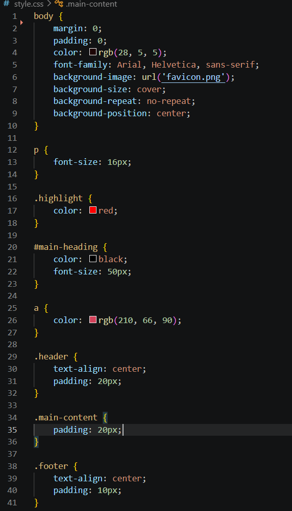
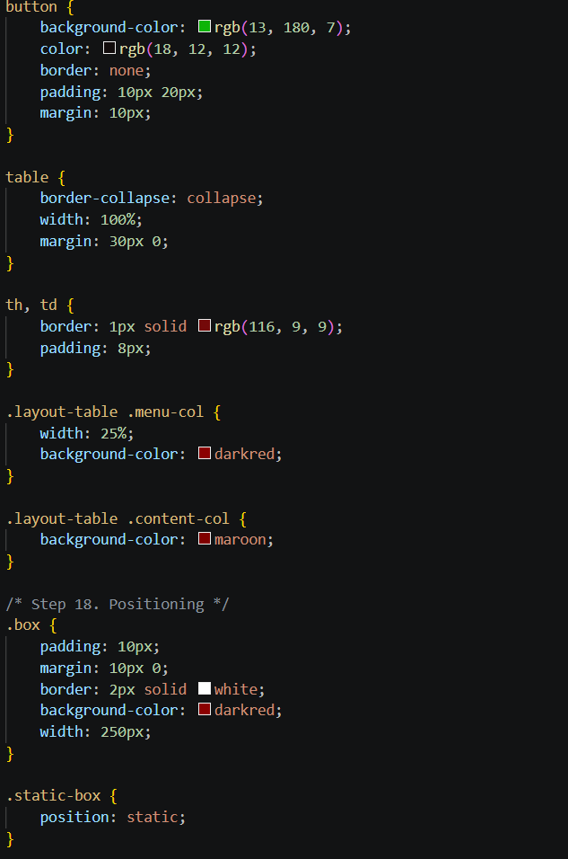
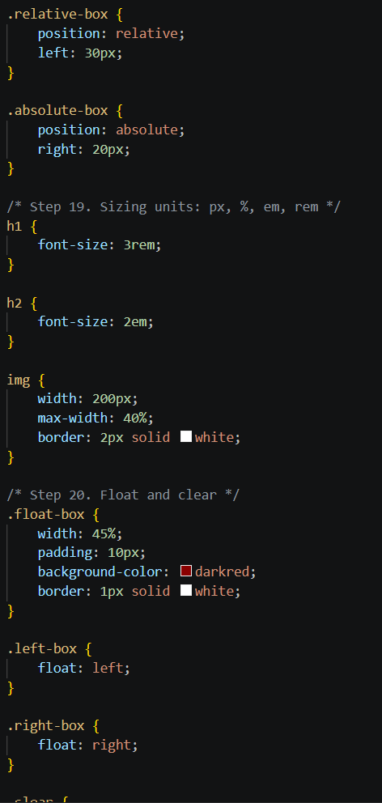
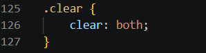
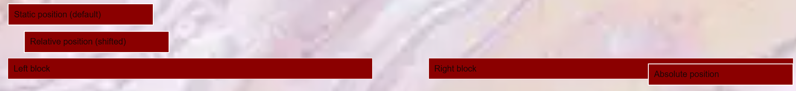
---

## Work Process Summary

I started by setting up the project folder and writing the basic HTML5 structure in `index.html`. For Part 1, I built the page header with headings, a short "About Me" paragraph, lists of hobbies and favorite websites, a photo, links, and a button.

In Part 2, I added a weekly schedule table, a two-column table layout, emojis, and a contact form with text, email, and color inputs.

For Parts 3 and 4, I practiced all three ways of applying CSS — inline, internal, and external — and used element, class, and ID selectors to style different parts of the page. I organized the layout into header/main/footer sections, applied the box model (padding, margin, borders), tested all three positioning types, used different sizing units, and built a floated two-box layout cleared with `clear: both`. Finally, I added a custom favicon, pushed everything to GitHub, and published the site with GitHub Pages.

## Resources
- Abitova G.A. Web Technologies: Front-End Development, Part 1 (2022)
- [W3Schools – HTML Basics](https://www.w3schools.com/html/html_basic.asp)
- [W3Schools – CSS Syntax](https://www.w3schools.com/css/css_syntax.asp)